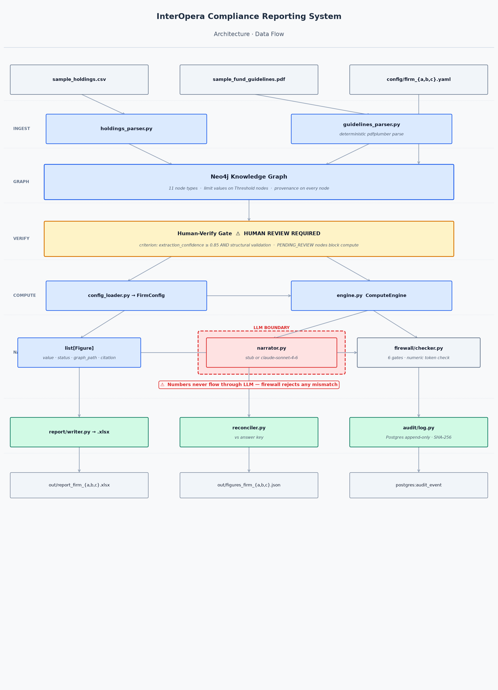
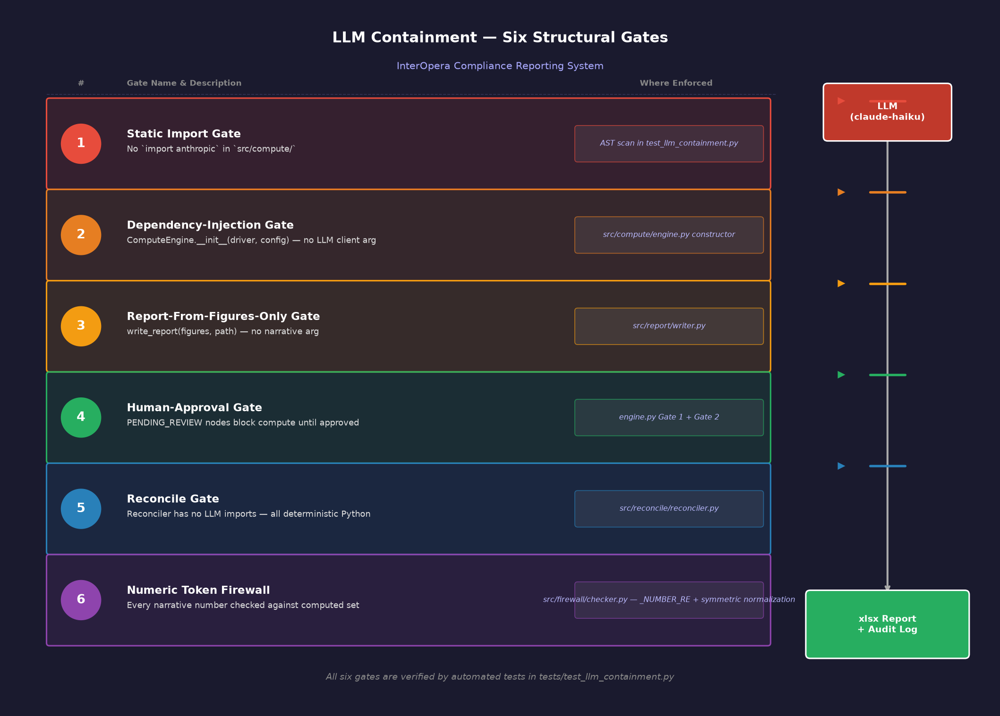

# Architecture

## Overview

This document describes the module architecture of the compliance reporting system. The design principle is that **numbers flow in one direction and never loop back through the LLM**. The LLM is structurally incapable of touching a computed figure.


*Full pipeline data flow: inputs → ingestion → graph → human-verify gate → compute → narrative/firewall → outputs.*


*Six structural LLM containment gates and where each is enforced.*

### Module Map (ASCII)

```
┌─────────────────────────────────────────────────────────────┐
│                        CLI (Typer)                          │
│   src/cli/main.py  ·  src/cli/commands/replay_helpers.py    │
└───────────────────────────┬─────────────────────────────────┘
                            │
          ┌─────────────────▼──────────────────┐
          │            Ingestion Layer          │
          │   holdings_parser.py               │
          │   guidelines_parser.py             │
          └──────────┬──────────────┬──────────┘
                     │              │
          PositionRecord        RuleChunk
                     │              │
          ┌──────────▼──────────────▼──────────┐
          │            Graph Layer              │
          │   schema.py  ·  builder.py         │
          │   queries.py                       │
          └──────────────────┬─────────────────┘
                             │ Neo4j
                    ┌────────▼────────┐
                    │     Neo4j       │
                    │   (nodes/edges) │
                    └────────┬────────┘
                             │                ┌───────────────────────┐
          ┌──────────────────▼──────────────┐ │   firm YAML config    │
          │           Compute Layer         │◄│  src/config/          │
          │   config_loader.py              │ │  firm_a.yaml          │
          │   registry.py                   │ │  firm_b.yaml          │
          │   primitives.py                 │ └───────────────────────┘
          │   engine.py                     │
          └──────────┬──────────────────────┘
                     │ list[Figure]
         ┌───────────┼───────────┐
         │           │           │
┌────────▼──┐  ┌─────▼──────┐  ┌▼────────────────────────┐
│ Reconcile │  │   Report   │  │   Narrative (LLM)        │
│           │  │  (xlsx)    │  │   narrator.py            │
│reconciler │  │ writer.py  │  │   (src/narrative/)       │
│   .py     │  │            │  │  ┌───────────────────┐   │
└────────┬──┘  └─────┬──────┘  │  │  Firewall Checker │   │
         │           │          │  │  checker.py       │   │
         │           │          │  └───────────────────┘   │
         │           │          └──────────────────────────┘
         │           │
         └─────┬─────┘
               │ all events
    ┌──────────▼──────────┐
    │        Audit        │
    │   Postgres          │
    │   audit_event table │
    │   (append-only,     │
    │    hash-chained)    │
    └─────────────────────┘
```

**Key flow invariant:** Numbers emerge from the Compute layer and flow **down** to Reconcile and Report. The Narrative (LLM) branch receives only a read-only copy of the Figure list for firewall checking — it does not write back into Report cells or the Compute layer. No arrow points from Narrative back to Compute, Reconcile, or Report cells.

---

## Layer Descriptions

### Ingestion

**Files:** `src/ingestion/holdings_parser.py`, `src/ingestion/guidelines_parser.py`, `src/ingestion/pdf_tables.py`, `src/ingestion/rule_extractors.py`

**Responsibility:** Parse raw inputs into typed Python objects. Emit `PositionRecord` and `RuleChunk` objects.

- `holdings_parser.py`: reads a CSV file row by row. Each row becomes a `PositionRecord` dataclass. Fields are validated at parse time (numeric fields coerced, required fields checked). Parsing is deterministic — same CSV always produces same records. `extraction_confidence = 1.0` for all position records.
- `pdf_tables.py`: deterministic pdfplumber table extraction with numeric-cleaning helpers (`pct_fraction`, `sgd_int`, `year_range`, `normalize_ws`, `extract_allocations`, `extract_risk_metrics`, `duration_bounds`, `dv01_cap`). No LLM imports.
- `rule_extractors.py`: anchored regex patterns (`extract_prose_rules`) applied to normalized page text. Extracts 5 prose rules (non-IG cap, corporate concentration, GRE cap, liquidity floor, counterparty cap). Confidence is a deterministic function of parse method: `_HIGH = 0.92` for rules with a unique, specific anchor phrase; `_LOW = 0.80` for rules in crowded multi-percentage paragraphs.
- `guidelines_parser.py`: assembles `RuleChunk` objects from `pdf_tables` and `rule_extractors`. `chunk_id = sha256(text.encode()).hexdigest()[:16]`. No `_STUB_PASSAGES` table; no LLM involvement. A golden snapshot (`tests/fixtures/parsed_guidelines.json`) plus `test_parse_matches_golden_snapshot` enforce byte-identical output across runs (constraint C1).

**Outputs fed into:** Graph layer (builder.py).

**LLM involvement: NONE.** The ingestion layer is pure code — pdfplumber + regex. No LLM client is injected by any CLI command.

---

### Graph

**Files:** `src/graph/schema.py`, `src/graph/builder.py`, `src/graph/queries.py`

**Responsibility:** Create and maintain the Neo4j property graph that represents the full compliance universe for a run.

- `schema.py`: defines all node labels, relationship types, and required properties. Serves as the single source of truth for graph structure.
- `builder.py`: consumes `PositionRecord` and `RuleChunk` lists. Creates nodes with provenance properties and `DERIVED_FROM` edges from rule-derived nodes back to their `SourceChunk`. Node `status` is set at creation time: deterministic nodes (positions, asset classes, issuers — `extraction_confidence = 1.0`) load `VERIFIED`; rule-derived `Limit`/`SourceChunk` nodes load `VERIFIED` when `extraction_confidence ≥ 0.85`, otherwise `PENDING_REVIEW`.
- `queries.py`: read-only Cypher query helpers used by the Compute engine and by the Human-Verify gate to list pending nodes. Includes `limit_bounds_for_ref(driver, limit_ref)` which traverses `(Limit {ref})-[:HAS_THRESHOLD]->(Threshold)` to retrieve bound values used by the engine.

**Low-confidence rule nodes load `PENDING_REVIEW`.** The Compute engine refuses to traverse any node whose anchor `Limit` is still `PENDING_REVIEW`, returning an `ERROR` figure instead of a number until a human approves it via `verify-graph`.

**Audit event emitted:** `graph_construction`.

---

### Compute

**Files:** `src/compute/config_loader.py`, `src/compute/registry.py`, `src/compute/primitives.py`, `src/compute/engine.py`

**Responsibility:** Traverse the verified graph and produce the 13 `Figure` objects deterministically.

- `config_loader.py`: resolves the effective config via `deep_merge(base.yaml, firm_X.yaml)`. The firm overlay sets only the three knobs that vary between firms (`non_ig.include_fallen_angels`, `concentration.gre.group_key`, `output.utilization_format`). `config/base.yaml` contains no `limits:` block — limit values live on graph `Threshold` nodes, not in YAML. Emits a `FirmConfig` Pydantic model (`extra="forbid"`). Hashes the resolved effective config for the audit log. Emits `config_loaded` audit event.
- `registry.py`: maps aggregator/comparator names (from graph nodes) to Python callables. Allows new figure types to be registered without touching engine logic.
- `primitives.py`: pure functions — `nav`, `sum_pct`, `weighted_avg_duration`, `dv01`, `max_group_pct` (aggregators); `within_min_max`, `max_cap`, `min_floor` (comparators); `percent_1dp`, `truncated_bps`, `years_2dp`, `sgd_dv01` (formatters). No I/O, no LLM calls. All use `Decimal` arithmetic.
- `engine.py`: `ComputeEngine.__init__(driver, config: FirmConfig)` — takes only a Neo4j driver and a FirmConfig. No LLM client parameter. For each figure, traverses `(Limit {ref: spec.limit_ref})-[:HAS_THRESHOLD]->(Threshold)` via `limit_bounds_for_ref` to obtain numeric bounds, then traverses positions and aggregates. Assembles `Figure` objects each carrying: `status` ∈ `{OK, BREACH, AT LIMIT}` (or `ERROR` for untraceable/blocked figures); `graph_path` as a Cypher-style string encoding the actual traversal; `citation` as a dict `{ "source_doc": str, "page": int, "chunk_id": str, "passage_summary": str }`. Citations are resolved per `limit_ref`, so each of the 7 allocation figures cites its own `SourceChunk`. Bounds are read once per figure and checked for completeness against the comparator's required keys (`_REQUIRED_BOUNDS`): a missing or partial `Threshold` (untrustworthy external data) yields an `ERROR` figure rather than a crash — the same boundary discipline as the citation and `PENDING_REVIEW` gates.

**LLM involvement: NONE.** Static import gate test asserts that `src/compute/` contains no imports of `anthropic`, `openai`, `httpx`, or `requests`.

**Audit event emitted:** `figure_computed` (once per Figure, 13 total).

---

### Audit

**Files:** `src/audit/log.py`, Postgres `audit_event` table

**Responsibility:** Record every significant pipeline event in an append-only, hash-chained log.

- `log.py`: class `AuditLogger`. `log_event(event_type, actor, payload, config_hash)` — inserts one row into `audit_event`. Computes `row_hash = sha256(canonical_json + prev_hash)`.
- `AuditLogger.verify_chain()` — re-derives all hashes in insertion order and asserts equality. Used by `show-audit-log --verify`.
- The table has no `UPDATE` or `DELETE` grants for the application role. A `BEFORE UPDATE OR DELETE` trigger raises an exception for all connections, including superusers running ad-hoc SQL.
- `retention_class` column: either `compliance` (long-term regulatory) or `operational` (short-term diagnostic).

---

### Reconcile

**Files:** `src/reconcile/reconciler.py`

**Responsibility:** Compare computed Figures against the firm's answer key and produce a per-figure pass/fail result.

- Loads the answer key from xlsx or YAML (firm-configurable).
- For each Figure, computes `delta = abs(computed_value - expected_value)`. Applies tolerance from `FirmConfig` (default: exact match).
- Produces `ReconciliationResult`: list of per-figure results + overall pass/fail flag.
- Contains **no LLM imports**. All reconciliation logic is deterministic Python.

**Audit event emitted:** `reconciliation`.

---

### Report / Narrative / Firewall

**Files:** `src/report/writer.py`, `src/narrative/narrator.py`, `src/firewall/checker.py`

**Responsibility:** Write the xlsx report, optionally generate narrative prose, and enforce the output firewall.

**Report:**
- `writer.py` receives `list[Figure]` only. Loads `sample_docs/report_template.xlsx` (Section + Metric pre-filled by the brief) and writes Value, Limit, Utilization, Status, Source into columns C–G. Falls back to generating a scratch workbook if the template is not found. Saves to `out/report_{firm_id}.xlsx`.

**Narrative (optional, LLM-powered):**
- `narrator.py` (in `src/narrative/`) calls the LLM with a prompt that includes the Figure list as context. When `ANTHROPIC_API_KEY` is absent, the deterministic stub path is used — no network call. Default model: `claude-sonnet-4-6`.
- Before the narrative is returned, `checker.py` scans it: every numeric token must appear in the computed Figure set. If any unrecognised number is found, the check fails and the CLI reports `Firewall FAIL`.

**Firewall:**
- `src/firewall/checker.py` is the enforcement point for the output firewall.
- It reads the figure set (source of truth) and the candidate narrative string.
- Returns a `FirewallResult` dataclass (`passed: bool`, `offending_numbers: list[str]`, `checked_numbers: list[str]`).
- The firewall is one-directional: it reads numbers from Figures, never writes numbers back to Figures.

**Audit events emitted:** `report_exported`. The `narrate` command does not emit an audit event.

---

## Node Types in Neo4j

| Node Label | Description |
|------------|-------------|
| `Position` | A single holding record parsed from the CSV. Properties: instrument_id, instrument_name, asset_class, issuer_name, issuer_type, credit_rating, downgraded_from, market_value_sgd, modified_duration (+ provenance). |
| `AssetClass` | Asset class taxonomy node (e.g., IG_CORP, HY_CORP, GOVT). |
| `Issuer` | Legal entity that issued the security held in a Position. |
| `ParentIssuer` | Parent entity of an Issuer, used for consolidated exposure calculations. |
| `Limit` | A limit rule node extracted from a RuleChunk. Keyed by `ref` (e.g., `allocation_sgs_limit`). Each figure's `limit_ref` points to one `Limit` node. |
| `Aggregate` | An intermediate aggregation node (e.g., total non-IG exposure). |
| `RiskMetric` | A market risk metric node (e.g., `portfolio_duration`, `portfolio_dv01`). |
| `Threshold` | Numeric bounds for a `Limit` or `RiskMetric`. Properties: `min_value`, `max_value`, `cap_value`, `floor_value`, `unit`, `key` (uniqueness key; risk thresholds also carry `metric`). |
| `BreachAction` | The action to take on a threshold breach (e.g., PM notification, Risk Committee alert). |
| `Owner` | The business unit or portfolio manager notified on a breach (e.g., Portfolio Manager, Chief Risk Officer). |
| `SourceChunk` | A raw RuleChunk from the guidelines PDF. All rule-derived nodes have a `DERIVED_FROM` edge pointing here. Carries `source_doc`, `page`, `chunk_id`, `passage_summary`, `extraction_confidence`, `status`, `ingested_at` (ingestion timestamp, satisfying the brief's provenance requirement for ingestion time). |

---

## Edge Types

| Relationship | From → To | Description |
|-------------|-----------|-------------|
| `IN_ASSET_CLASS` | Position → AssetClass | Classifies a position into an asset class. |
| `ISSUED_BY` | Position → Issuer | Links a position to its issuer. |
| `ROLLS_UP_TO` | Issuer → ParentIssuer | Represents the GRE parent-child issuer hierarchy. |
| `CONTRIBUTES_TO` | AssetClass → Aggregate | A non-IG asset class contributes to the `non_ig` aggregate bucket. |
| `HAS_THRESHOLD` | Limit → Threshold | Links a `Limit` node to its `Threshold` node carrying numeric bounds (`min_value`, `max_value`, `cap_value`, `floor_value`, `unit`). The engine traverses this edge via `limit_bounds_for_ref` to obtain bounds at compute time. |
| `HAS_BREACH_ACTION` | RiskMetric → BreachAction | Links a risk metric to the action triggered on breach. |
| `NOTIFIES` | BreachAction → Owner | Identifies who is notified when a breach action fires. |
| `DERIVED_FROM` | Limit or RiskMetric → SourceChunk | Provenance edge: traces every rule-derived node back to its source PDF chunk. Used by `_get_citation` to resolve per-figure citations. |

---

## Data Flow Emphasis

The following invariants are maintained by the architecture:

1. **Numbers flow one direction.** A figure value is computed in `engine.py`, written to a `Figure` object, passed to `writer.py` (xlsx), passed to `reconciler.py` (comparison), and passed as read-only context to `checker.py` (firewall). No step in this path writes a value back to an upstream layer.

2. **Prose and numbers have separate paths.** The narrative path (`narrator.py` → LLM → `checker.py` → narrative file) is entirely separate from the number path (`engine.py` → `Figure` list → `writer.py` → xlsx). The two paths meet **only at the firewall** (`checker.py`), and even there the flow is one-directional: the firewall reads numbers from Figures to validate the prose; it never writes numbers back.

3. **The LLM is structurally incapable of touching a number.** This is not a policy statement enforced by convention — it is enforced by:
   - Static import gate: `src/compute/` has no LLM library imports (tested).
   - Dependency injection gate: `ComputeEngine.__init__` accepts no LLM client parameter.
   - Report writer gate: `writer.py` accepts only `list[Figure]`, not a narrative string.
   - Human-only approval gate: `approve_node()` requires an explicit human `actor` argument.

---

## Key Design Principle

> **The LLM must be structurally incapable of touching a number.**

This is not achieved by prompt engineering or runtime guardrails alone. It is achieved through module boundaries, dependency injection contracts, and static analysis tests that would fail if LLM imports were introduced into the compute layer. The architecture is designed so that even a compromised or hallucinating LLM cannot produce a number that ends up in the xlsx report or in the reconciliation outcome.

---

## Infrastructure & Tooling Decisions

Each entry follows the format: **Decision → Alternatives considered → Rationale**.

---

### Docker Compose

**Decision:** Use Docker Compose to orchestrate Neo4j, Postgres, and the Python app as services.

**Alternatives:** Bare `venv` with manually managed services; Kubernetes (k8s).

**Rationale:** Docker Compose gives dev/CI environment parity with a single `docker compose up` command. Service health checks (`healthcheck:` stanzas) ensure Neo4j and Postgres are ready before the app starts, eliminating race-condition failures in CI. Kubernetes is operationally correct for production but adds significant complexity (Helm, cluster provisioning, RBAC) that is disproportionate to a single-machine compliance batch tool. Bare venv requires every developer to manually start Neo4j and Postgres and manage their versions — a source of environment drift.

---

### Neo4j 5.18 + APOC

**Decision:** Use Neo4j 5.18 as the graph store with the APOC plugin.

**Alternatives:** Postgres `pgvector` / recursive CTE approach; DGraph; in-memory Python `dict` graph.

**Rationale:** Compliance rules map naturally to a property graph: issuers roll up to parent issuers, positions belong to asset classes, limits apply to entities — these are all native graph relationships. Neo4j's Cypher `MERGE` is idempotent by design, which is critical for re-runnable ingestion pipelines: running `MERGE (n:Issuer {id: $id})` twice is safe. APOC provides `apoc.schema.assert` for enforcing uniqueness constraints at startup, and `apoc.periodic.iterate` for large batch operations. Postgres with recursive CTEs can model graphs but requires hand-written traversal logic and is significantly slower on multi-hop queries (e.g., consolidated issuer exposure across three parent levels). DGraph has a smaller ecosystem and fewer operational precedents in compliance tooling. An in-memory dict cannot survive process restarts and cannot be queried by multiple tools.

---

### Postgres 16 for Audit Log

**Decision:** Use Postgres 16 to store the `audit_event` table.

**Alternatives:** SQLite; append-only flat file; Redis streams.

**Rationale:** The audit log requires tamper-evidence: `BEFORE UPDATE` and `BEFORE DELETE` triggers fire before any modification and can raise an exception to block it, making the table append-only at the database level rather than by application convention. Postgres provides full ACID guarantees, meaning a crash mid-insert leaves no partial rows. `pg_isready` gives a standard health check endpoint used by Docker Compose. SQLite lacks per-table role grants, making it harder to enforce the application role having only `INSERT` and `SELECT`. A flat file has no transaction semantics and is trivially corruptible. Redis streams are append-only but lack SQL querying, JOINs, and the row-level security model needed for long-term compliance retention.

---

### Typer (CLI framework)

**Decision:** Use Typer for the CLI layer (`src/cli/`).

**Alternatives:** Click; `argparse`.

**Rationale:** Typer generates `--help` output and argument parsing automatically from Python type annotations — the function signature `def run(firm: str, holdings: Path, guidelines: Path)` is the full CLI contract, with no separate decorator registration required. Typer is built on Click under the hood, so Click's ecosystem applies, but Typer removes the boilerplate of `@click.option` decorators. It has native Rich integration for structured terminal output. `argparse` requires explicit `add_argument` calls for every parameter and produces less readable help output.

---

### Pydantic v2 with `extra=forbid`

**Decision:** Use Pydantic v2 with `model_config = ConfigDict(extra="forbid")` on all config models.

**Alternatives:** Pydantic v1; Python `dataclasses`.

**Rationale:** `extra="forbid"` causes Pydantic to raise a `ValidationError` at config load time if the YAML contains any unrecognised key (e.g., a typo like `non_ig_limit` instead of `non_ig`). Without this, a typo silently falls through and the figure is computed against the wrong default — a compliance-critical bug that appears to succeed. Pydantic v2 is significantly faster than v1 for model validation (Rust-backed core) and has improved error messages. Plain `dataclasses` have no built-in schema validation or coercion; a string `"0.10"` from YAML would not be automatically converted to `Decimal("0.10")`.

---

### psycopg3 binary

**Decision:** Use `psycopg[binary]` (psycopg3) for Postgres connectivity.

**Alternatives:** `psycopg2`; SQLAlchemy ORM.

**Rationale:** psycopg3 is the current maintained driver with native Python 3.11+ async support (`AsyncConnection`). The binary distribution bundles libpq, eliminating system-level dependency on `libpq-dev` in Docker images. psycopg2 is in maintenance-only mode. SQLAlchemy ORM adds an abstraction layer that is unnecessary here — all queries are explicit parameterised SQL (`INSERT INTO audit_event ...`), and ORM magic would obscure the append-only constraint enforcement that is central to the audit design.

---

### Rich for terminal output

**Decision:** Use Rich for all CLI output (tables, status messages, progress).

**Alternatives:** `tabulate`; plain `print`.

**Rationale:** Rich renders structured tables with color-coded status columns (`OK` in green, `BREACH` in red) without custom formatting code. It respects `NO_COLOR` and non-TTY environments (CI pipelines) automatically, falling back to plain text. `tabulate` produces plain ASCII tables with no color or live progress. Plain `print` requires manual column alignment and ANSI escape code management.

---

### openpyxl for Excel output

**Decision:** Use `openpyxl` to write the compliance report xlsx.

**Alternatives:** `xlsxwriter`; `pandas.ExcelWriter`.

**Rationale:** Cell-level styling — specifically coloring each row red/amber/green based on figure status — requires per-cell `PatternFill` and `Font` control. openpyxl exposes the full OpenXML model, making this straightforward. `xlsxwriter` is write-only (cannot read existing files) and has a different API for cell styling. `pandas.ExcelWriter` wraps openpyxl or xlsxwriter but adds a pandas dependency that is not otherwise needed, and the abstraction layer makes per-row conditional formatting more verbose, not less.

---

### pytest

**Decision:** Use `pytest` as the test framework.

**Alternatives:** `unittest` (stdlib).

**Rationale:** pytest fixtures allow dependency injection (Neo4j driver, Postgres connection) with clear setup/teardown scoping. `@pytest.mark.parametrize` drives data-driven tests (e.g., all 13 figure computations from a single test function) without boilerplate. Assertion failure messages show the actual vs. expected values directly, without `assertEqual(a, b)` wrapping. `unittest` is functional but verbose — `setUp`/`tearDown` class methods, `self.assert*` calls, and no parametrize equivalent without third-party extensions.

---

### claude-sonnet-4-6 for narrative generation

**Decision:** Use `claude-sonnet-4-6` as the default LLM for narrative prose generation. Override via `ANTHROPIC_MODEL` env var.

**Alternatives:** `claude-haiku-4-5-20251001` (faster, cheaper, shallower output); GPT-4o (external vendor).

**Rationale:** Sonnet produces auditor-grade output — structured section headings, per-metric utilization citations, page references, and a summary compliance table. Haiku is functionally correct and ~3–5× cheaper but produces shorter, less structured narratives without page citations. The output firewall (`checker.py`) enforces numeric correctness independently of model choice; the decision is purely about prose quality. See `docs/DECISIONS.md §23` and `docs/model_comparison.md` for the full three-model comparison (Haiku / Sonnet / Opus 4.8).
